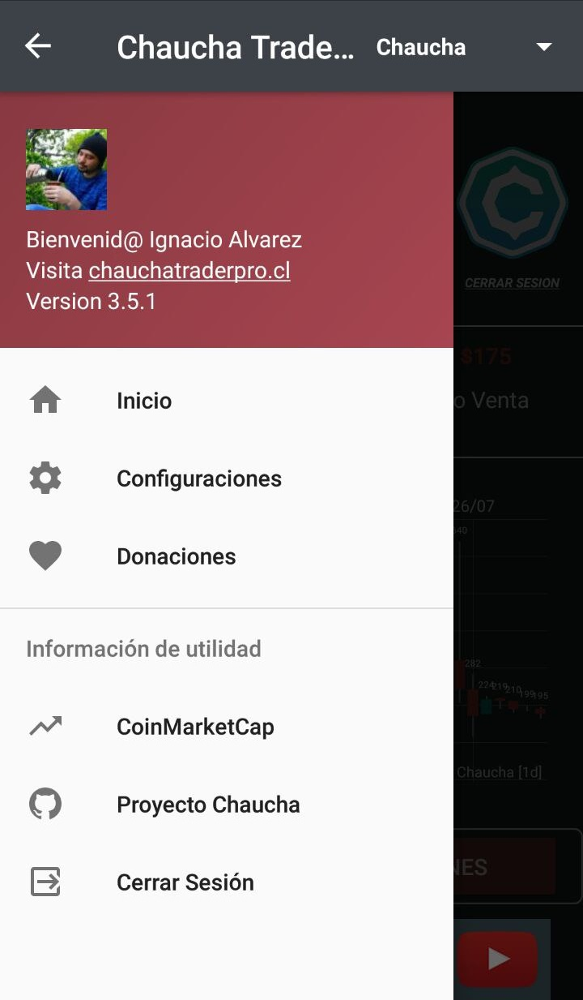
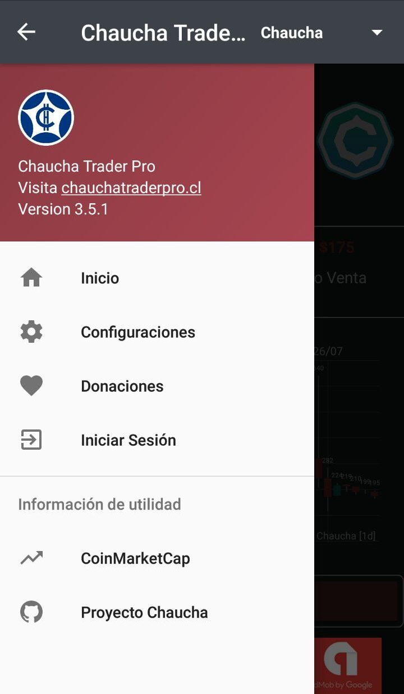
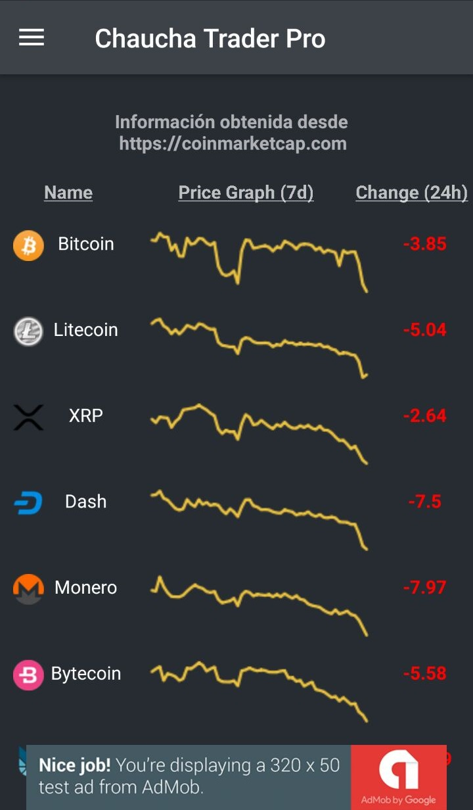
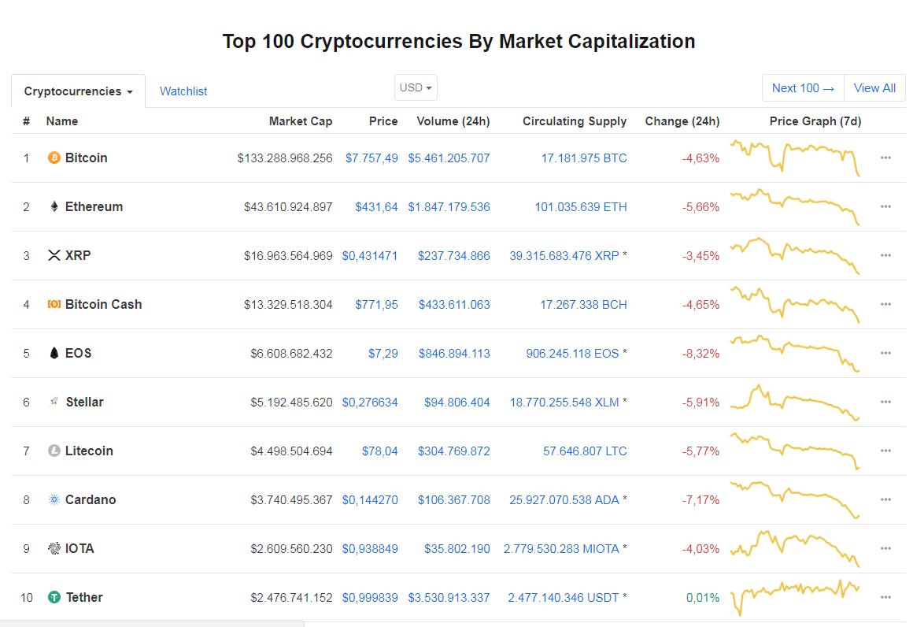
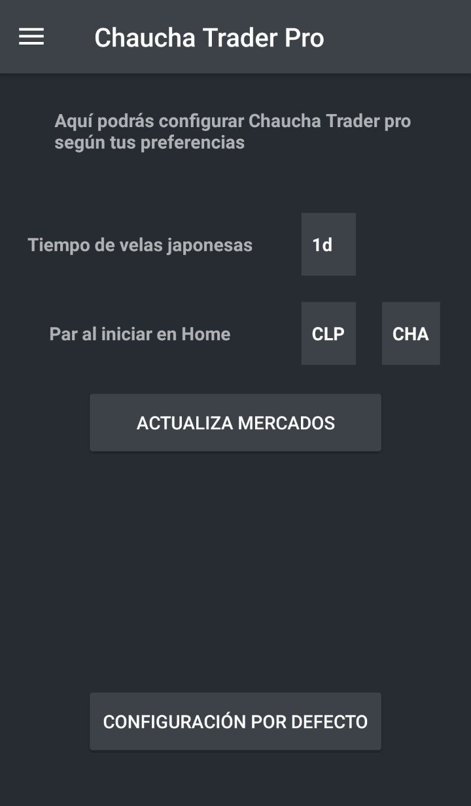
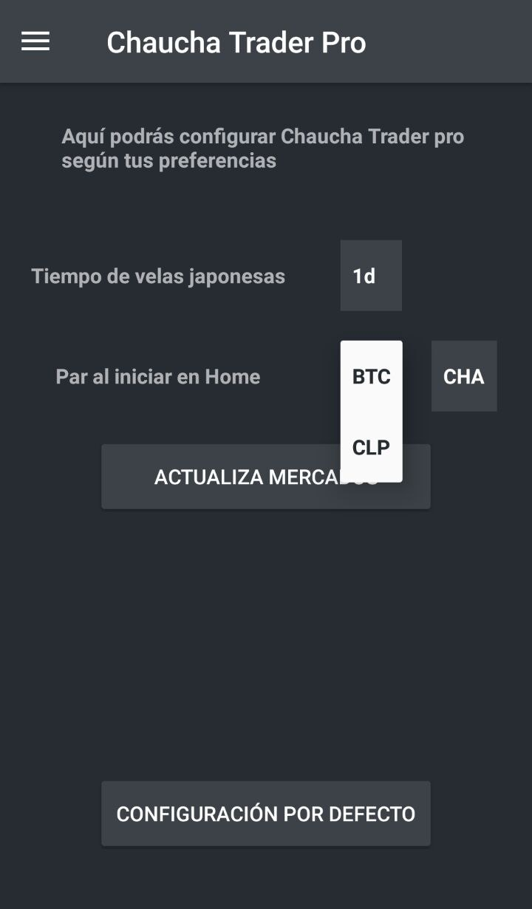
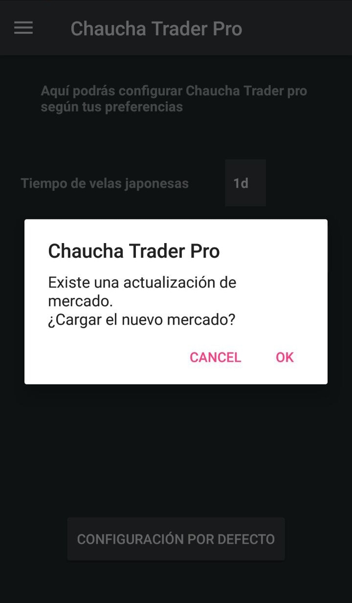

# Chaucha Trader Pro

Con la reapertura de las cuentas del exchange OrionX, la app [Chaucha Trader Pro](https://play.google.com/store/apps/details?id=com.panterozo.chauchatraderpro) volverá a funcionar sin problemas, enhorabuena!.

Por otra parte, te comento que he trabajado en varias funcionalidades en la aplicación para llevarla a otro nivel, para que la experiencia del usuario sea fantástica y rica en contenido. Estas mejoras vendrán con nuevas actualizaciones. Actualiza la aplicación en el siguiente link [Chaucha Trader Pro](https://play.google.com/store/apps/details?id=com.panterozo.chauchatraderpro).

Se vienen nuevos proyectos, y tu apoyo es fundamental.

## Imagen de Perfil

La imagen de perfil del menú, se obtiene desde lo que se conoce como **Globally Recongnized Avatar** o **Avatar reconocido mundialmente**. La idea detrás de esto, es que con tu correo electrónico tengas un avatar global en internet. De esta manera, no es necesario subir una imagen en cada sitio por el cual navegues. 

Para incluir tu imagen en **Chaucha Trader Pro**, te recomendamos subirla en [Gravatar](https://es.gravatar.com/), con el correo electrónico con el cual estés iniciando sesión.

Tu gravatar | Avatar por defecto
-----|-------
 | 

## CoinMarketCap

El sitio web [CoinMarketCap](https://coinmarketcap.com/) nos provee de información sobre una gran variedad de monedas a nivel global, tales como su valor, total de monedas en circularización, el volumen de las últimas 24 horas o la capitalización total de mercado.

La información es actualizada cada 5 minutos.

Los sistemas de CoinMarketCap buscan en un conjunto de Exchanges los montos transados en esas monedas, y es uno de los sitios más visitados en el mundo crypto.

CoinMarketCap en Chaucha Trader | CoinMarketCap Online
-----|-------
 | 

## Configuraciones

Las opciones de configuración de Chaucha Trader Pro te permitirán:

- Seleccionar un valor por defecto para las velas japonesas
- Seleccionar la moneda que quieres por defecto. Tenemos por ahora, *par* Bitcoin y CLP.
- Actualizar mercados 
- Configuración por defecto 

El botón **Actualizar Mercados** buscará si existe alguna nueva moneda que agregar o quitar en Chaucha Trader Pro. De haber cambios en los mercados, podrás actualizar la configuración de la aplicación con un click. 

El botón **Configuración por defecto** te permitirá reiniciar los valores de los componentes configurables.

Home Configuración | Pares Disponibles | Actualizar mercados
-----|-------|-------
 |  | 

## Proyecto Chaucha

La primera vez que escuché con respecto a Chaucha, fue en un canal de televisión, en Diciembre pasado, cuando el valor de Bitcoin llegaba a sus máximos históricos. ¿Quién no pensó en haber comprado antes para lograr un poco de aquella riqueza tan inmediata?.

Comencé de inmediato a buscar información con respecto a Chaucha, que era la nueva criptomoneda Chilena. Las primeras Chaucha 

Muchos que compraron Bitcoin a un bajo precio, lograron millones de dolares en Diciembre, haciendose millonarios de la noche a la mañana, o eso nos decían.

La verdad es que no es tan así. Ya que llevo poco más de medio año involucrado en el mundo de las criptomonedas, puedo decir que propiedad que 

Supe en ese momento que tenía que involucrarme, entender de qué trataba este mundo que daba tanto que hablar por aquel entonces.

Desde que llegaron

A continuación te dejo el principal objetivo del proyecto, aunque no el único.

"*Una organización enfocada en diseñar e implementar herramientas de software que ayuden a la adopción y educación de las personas hacia la tecnología Blockchain.*

*La finalidad del Proyecto Chaucha es permitir que los nuevos usuarios de criptomonedas puedan aprender sobre el funcionamiento de los sistemas a partir de un ejercicio práctico, utilizando las herramientas y la documentación generada por los miembros la organización.*"

## Donaciones

Chaucha Trader Pro es el resultado de un arduo trabajo de varias semanas, para que todos puedan tener un producto de excelencia y gratuito para la comunidad.

Con este mismo ánimo y para ayudarme también a seguir con el proyecto, te dejo mis diferentes wallets, en caso que deseen realizarme algún aporte voluntario. Cualquier aporte es bienvenido, por mínimo que sea.

Crypto | Wallet
-----|-------
**Chaucha** | `ceoNBCv1JF6GgeAhsFLk6efbRkCX5n8kZn`
**Luka** | `LK3Rwd2ffUxAUHj6bW8zkECLmn1SXawJ4C3oNzJJtcBh5AWJ5BfVwBs3NrzUxway5tNkcFBF333tR47eQLJXNQ3ECm6XbJV` **Luka (Payment ID):** `920ee32f90c717ada4b261c08004b76294cfd83ed864078de7a30ffa9b94d262`
**Bitcoin** | `1CWpA2XnFnfTnbAJN94MpQWyunJgoKYz8K`
**Ethereum** | `0x9f2688B1a76CC24dA8610E90767c319fb2EA2Af0`
**Ripple** | `rhQrkgoV4uza557mW6HbBWMtTDkB7u5yrs` **Ripple (Destination Tag):** `981`
**Litecoin** | `LVBocBQpqD7FrXiUNrAtrkQtw1JdG6CBQt`
**Bitcoin Cash** | `14X2cEXpT6BLhFtFhYizCdUgoKtAXede4Z`
**Dash** | `XytqZKeKyMgG1k5meGocmtGGgPnqH7kRiM`

Puedes descargar la app [Aquí](https://play.google.com/store/apps/details?id=com.panterozo.chauchatraderpro).

Visita la página de bienvenida [Aquí](https://github.com/panterozo/Donaciones/blob/master/index_prev.md)

