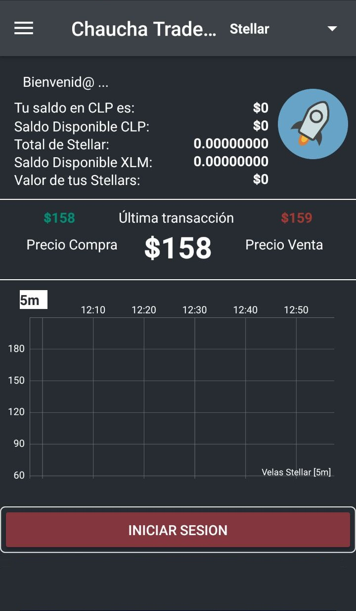

# Chaucha Trader Pro

Con la apertura de Stellar en OrionX, lo único que tienes que hacer en la app es dar click en **Actualizar Mercados**. 

El botón **Actualizar Mercados** buscará si existe alguna nueva moneda que agregar o quitar en Chaucha Trader Pro. 

El botón **Configuración por defecto** te permitirá reiniciar los valores de los componentes configurables.

Home Configuración | Actualizar mercados | Stellar en Chaucha Trader
-----|-------|-------
 |  |  

## Donaciones

Chaucha Trader Pro es el resultado de un arduo trabajo de varias semanas, para que todos puedan tener un producto de excelencia y gratuito para la comunidad.

Con este mismo ánimo y para ayudarme también a seguir con el proyecto, te dejo mis diferentes wallets, en caso que deseen realizarme algún aporte voluntario. Cualquier aporte es bienvenido, por mínimo que sea.

Crypto | Wallet
-----|-------
**Stellar** | `GBGX2VRRGLCLMPPS6DZC7FYCPKEHGWLDTYBXUSZH5NSM4MIOUY4XGOCC` **NEMO:** `248`
**Chaucha** | `ceoNBCv1JF6GgeAhsFLk6efbRkCX5n8kZn`
**Luka** | `LK3Rwd2ffUxAUHj6bW8zkECLmn1SXawJ4C3oNzJJtcBh5AWJ5BfVwBs3NrzUxway5tNkcFBF333tR47eQLJXNQ3ECm6XbJV` **Luka (Payment ID):** `920ee32f90c717ada4b261c08004b76294cfd83ed864078de7a30ffa9b94d262`
**Bitcoin** | `1CWpA2XnFnfTnbAJN94MpQWyunJgoKYz8K`
**Ethereum** | `0x9f2688B1a76CC24dA8610E90767c319fb2EA2Af0`
**Ripple** | `rhQrkgoV4uza557mW6HbBWMtTDkB7u5yrs` **Ripple (Destination Tag):** `981`
**Litecoin** | `LVBocBQpqD7FrXiUNrAtrkQtw1JdG6CBQt`
**Bitcoin Cash** | `14X2cEXpT6BLhFtFhYizCdUgoKtAXede4Z`
**Dash** | `XytqZKeKyMgG1k5meGocmtGGgPnqH7kRiM`

Puedes descargar la app [Aquí](https://play.google.com/store/apps/details?id=com.panterozo.chauchatraderpro).

Visita la página de bienvenida [Aquí](https://github.com/panterozo/Donaciones/blob/master/index_prev.md)

